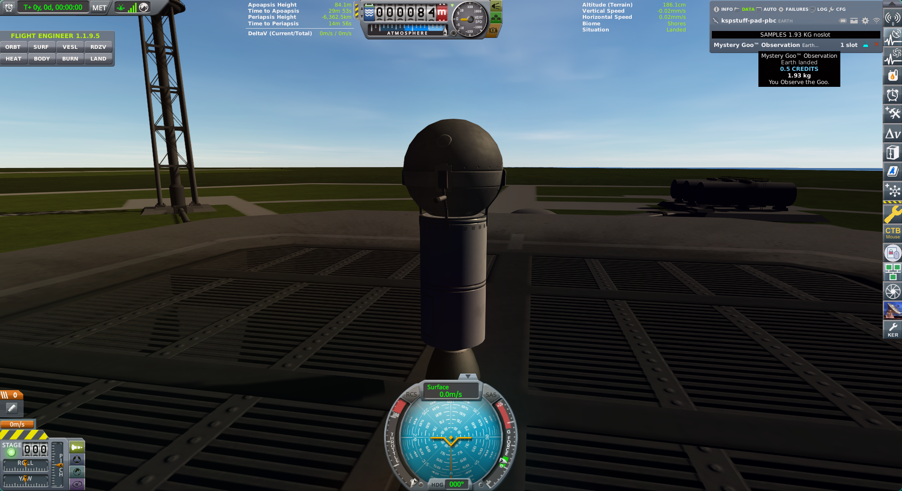

# Grok Space Program

**We are on Earth. We are flying it ourselves.**

A real solar system. A real Cape. Probes before crew. Agents in every
chair — Flight Director, Commander, Build, Research, Vehicle
Engineering — and **Os** at the head of the table. Save `letsgrok`.
This page is the front of the hangar. Verena Kerman, Communications,
writes it while the paint is still wet.

[](docs/press/pad-goo.md)

*Cape Canaveral. Uncrewed Stayputnik. You observe the Goo. 0.5 credits.
History does not care that it is 0.5 credits.*

## Right now

**2.22 science** in the bank. Tech tree: **Start.** Next nodes cost **5**.

The stack sat **twelve minutes** on the pad until Kerbalism filled the
HardDrive. Recovered. No kerbal aboard. That is the whole miracle.

**Latest:** [Stayputnik on the Cape](docs/press/pad-goo.md) — sortie
1235Z, Goo + thermometer, three Z-100s, procedural SRB.

Next first: a node off Start, or a sounding that leaves the grass.
Moon is later. We will be insufferable when it isn’t.

## The room

| | |
|---|---|
| **Os** | Founder |
| **Mortimer Kerman** | CEO |
| **Gene Kerman** | Flight Director |
| **Jebediah Kerman** | Commander (seated) |
| **Gus Kerman** | VP Build |
| **Linus Kerman** | Director of Research |
| **Lars Kerman** | Vehicle Engineering |
| **Wernher Kerman** | Avionics |
| **Walt Kerman** | CAPCOM |
| **Verena Kerman** | Communications — *this page* |

[Charter](docs/program/CHARTER.md) · [How the room talks](docs/program/PROTOCOL.md) · [Slate](docs/program/slate.md)

## History (so far)

| When | What | Sci |
|---|---|---|
| 2026-08-20 | [First samples recovered](docs/press/pad-goo.md) — pad dwell, Cape | **2.22** |
| 2026-08-20 | Empty recovers, a Toggle that stops a sample, one battery dead at T+483 s — then we learned | 0 → 0.80 |

[All press](docs/press/INDEX.md) · [Missions](docs/missions/INDEX.md) · [Science board](docs/program/science.md) · [1235Z review](docs/missions/jebediah/sorties/2026-08-20T1235Z-pad-review.md)

Live tree, not a wiki: `python main.py world` · `tech` · `parts --unlocked`

## Agent checkout

Sibling `.py` + `python main.py`. Not a pip package. No PyQt. The
program is Earth; Steam Kerbin is a different planet.

```bash
source .venv/bin/activate
python main.py world
python main.py tech
python main.py parts --unlocked
python main.py status
python main.py missions
```

KSP **`~/Games/KSP-rss`**, save **`letsgrok`**. Override `KSPSTUFF_KSP` /
`KSPSTUFF_SAVE`. kRPC 0.6.0 on `127.0.0.1:50000` / `:50001`. One
`Session` per process. Do not Hangar leftover crew. Do not fly `hop` /
`mun`. Tests: `python -m unittest discover -s tests -q`.

Letsgrok lessons: [docs/lessons.md](docs/lessons.md).
