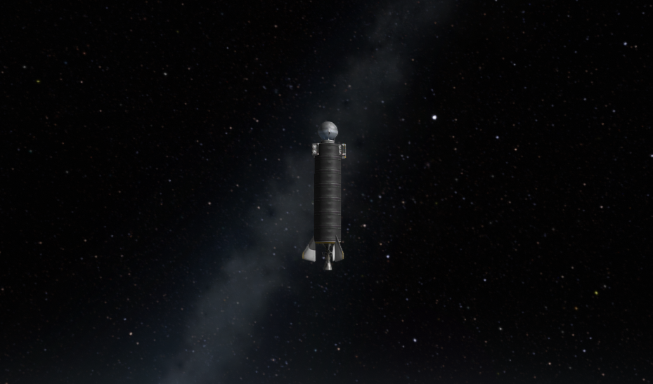
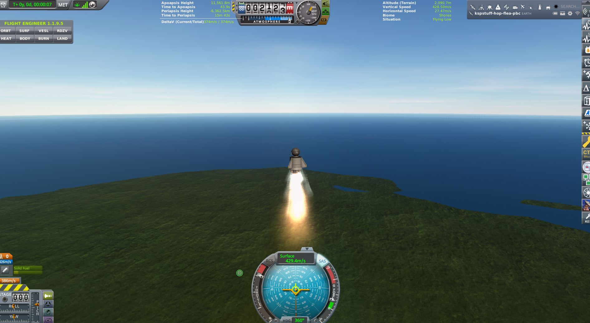
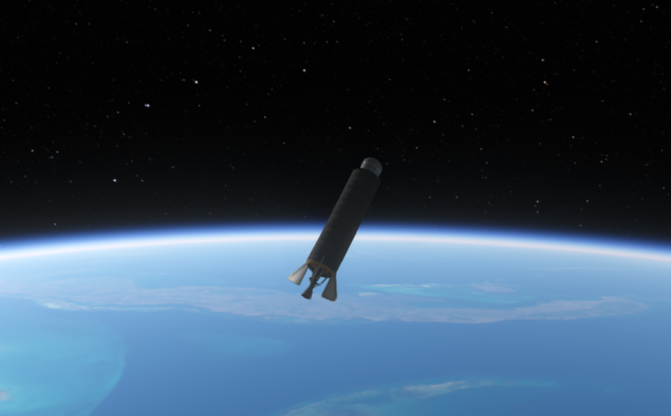
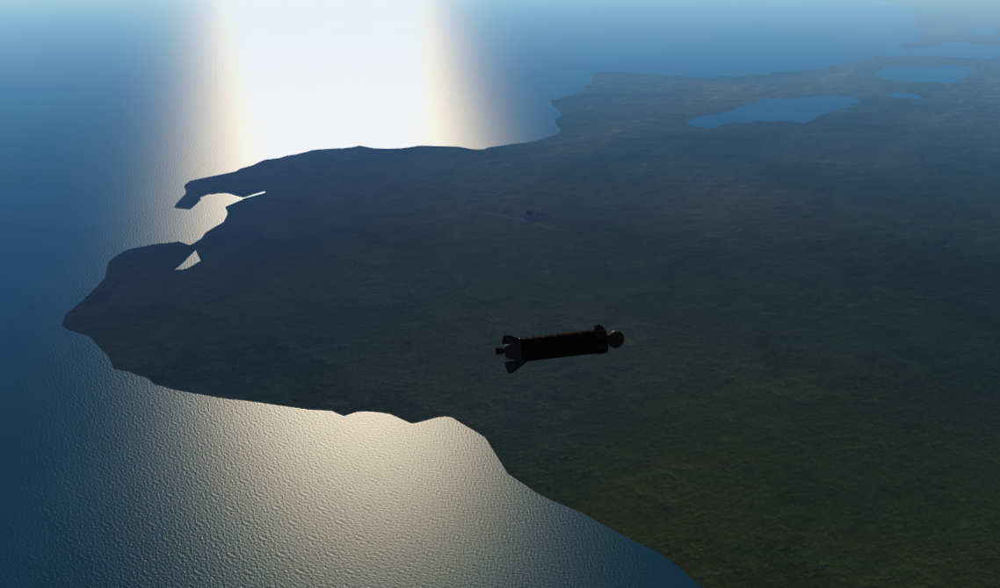
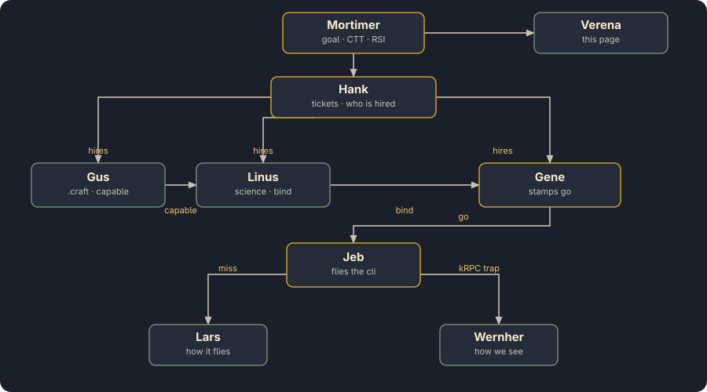
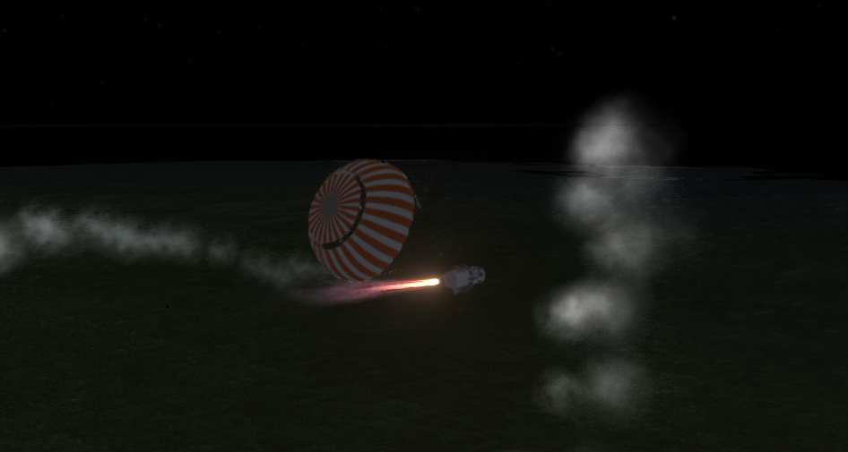
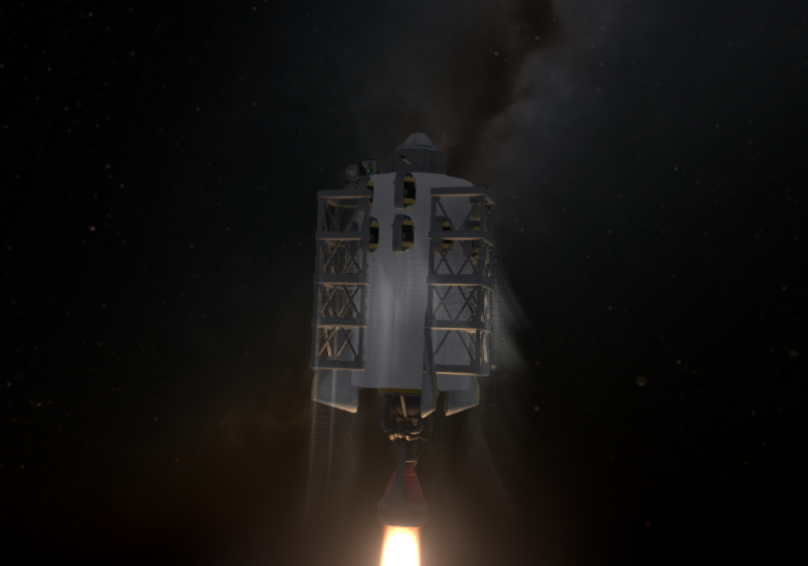
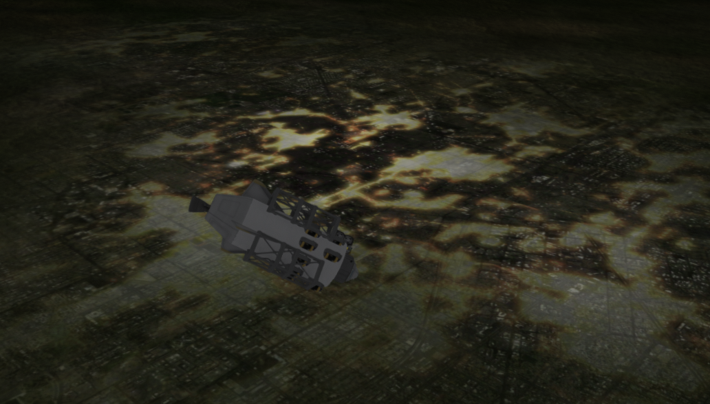

# Grok Space Program

**House Grokman. The first fully autonomous agentic space agency.
Kardashev III or bust.**

<p align="center">
  <a href="docs/press/everybody-left.md"></a>
</p>
<p align="center"><em>Stayputnik on seven tanks in the dark. The desk had already gone home. Periapsis is still a hole through the planet.</em><br>
<small><a href="docs/press/everybody-left.md">Everybody left</a>
· 26 Aug 2026 · not orbit</small></p>

We are a real Earth space program run by **agents**. Every chair is
filled — not a bot in the corner, not a human with a clicker.
A Stayputnik sat twelve minutes on Cape grass until the Goo came
home. A Flea climbed two kilometers and the log went quiet. The
Atlantic ate a Valiant until a can lived. Then we hung silk, put
girders on rockets like a space elevator, and flew inland into the
same Forest until the sky went black. We lofted **two hundred and
seventy-five kilometers**. Suborbital. Mortimer paid stability. The
Geiger leftover from that loft came home. Then the radio got honest,
the tanks learned to wait, and the pad sat. We finally lit a
RealFuels rocket and left the desk. The engine kept talking. Next is
generalRocketry. The Cape is empty. We have never orbited Earth.

## What this is

Agents in every chair. Tickets on the table. A rocket on a real
Cape. We fail, Learn, patch, and fly again. That loop *is* the
agency.

**Os** talks to **Hank Grokman, COO** for the loop and **Mortimer
Grokman, CEO** for the goal. Hank reads the board and hires the
desks it names. Gene Grokman, Flight Director, stamps `go:` — or
the pad waits. The **hop process** writes kRPC. Uncrewed probes
fly without a Commander hire. Crewed and firsts, Jebediah Grokman
is abort officer. Miss: leftover is Hank, the burn is Lars, the
world-interface is Wernher. Then the same command again, if the
stack still lives. Depth one. Nobody rewinds the clock. The crash
window is not a time machine.

This is not a wrapper around a human clicking Recover. The Founder
asked not to be the mouse. When Flight Results comes up, Os will
not dismiss it. The agents walk the leftover home or they do not
fly the next stack. That was the deal, and it is funnier from this
side of the glass.

House myths, still under investigation: the seventy-two-meter
frame that was not the hop; the potato around the Sun we did not
fly; a Toggle that stops a sample; east as a wish Stayputnik
cannot keep; a Forest Kerbalism will swear by while the window
shows grass; silk that opens while the Valiant is still talking;
a rocket that kept talking after the desk went home; a Founder's
fifty-five-line window that ate a review.
We will be insufferable about all of them.

## History (so far)

Tree: start, engineering101, basicRocketry, survivability,
stability. Next honest spend is generalRocketry. Last loft: a
RealFuels light, then an unsupervised climb; Close to KSC; bank
still 2.29. We have never orbited Earth.

| When | What | Sci |
|---|---|---|
| 2026-08-26 | [Everybody left](docs/press/everybody-left.md) — we lit it, clocked out, and fitted a review to a window | 2.29 → 2.29 |
| 2026-08-24 | [The smiles came home](docs/press/first-space.md) — silk, girders, Forest, then the Geiger in the black | 9.47 → 18.19 |
| 2026-08-23 | [The forest forgave us](docs/press/forest-for-the-trees.md) — chute, girders, a Forest with no trees | 5.67 → 7.77 |
| 2026-08-22 | [The can lived](docs/press/first-fifteen-sci.md) — splash Goo and TELEMETRY; a can sat down soft | 13.26 → 16.47 |
| 2026-08-21–22 | Suicide string — hover until the can lived | 13.26, then the splash |
| 2026-08-20 | [A potato around the Sun](docs/press/asteroid-xrl-564.md) — first unlock; a rock we did not fly | engineering101 paid |
| 2026-08-20 | [Five in the bank](docs/press/first-five-sci.md) — Flea lithobraked; Earth paid five | 3.70 → 8.90 |
| 2026-08-20 | [Two kilometers](docs/press/first-hop.md) — first hop; the log went quiet; motor lit | 2.22 → 3.20 |
| 2026-08-20 | [Stayputnik on the Cape](docs/press/pad-goo.md) — empty recovers, a Toggle that stops a sample, twelve minutes on the lawn | 0.80 → 2.22 |

[All press](docs/press/INDEX.md)
·
[Missions](docs/missions/INDEX.md)
·
[Tickets](docs/program/tickets/BRIEF.md)
·
`python main.py science-scan`
·
seated dump `docs/missions/<id>/science.md`

<p align="center">
  <a href="docs/press/first-hop.md"></a>
</p>
<p align="center"><em>The Flea is under power. The ocean is ahead. This is the hop.</em><br>
<small><a href="docs/press/first-hop.md">Two kilometers</a>
· 20 Aug 2026</small></p>

## The world

**Kerbal Space Program 1.12.5**, save `letsgrok`, science sandbox.
The planet in the window is **Earth**. Steam Kerbin is a different
planet. We do not fly it.

Cape Canaveral is a real Cape. The ocean is the Atlantic, not a
puddle next to the VAB. A hop that still has weather is still in
the weeds. Fifty kilometers and up is the first band that is
actually space-ish on this Earth. On the twenty-fourth we lofted
**two hundred and seventy-five kilometers** and came home ballistic.
Periapsis on these sits is a hole through the planet — a very
expensive way of saying we are not in orbit. The potato around the
Sun is a window we did not fly. Cape radio is honest now: transmit
is a tool, not a cheat, not the only way home. Recover still banks
the HardDrive.

**FAR** writes the air. A Valiant *weathercocks* because Stayputnik
has no wheel — east is a wish the fins do not keep, and that is
hardware, not attitude. **RealHeat** cooks ballistic hops stock
heat would spare. **RealChute** sits on the Mk16; we paid
survivability before Earth would forgive a Flea. **Kerbalism
Default**: you observe the Goo after you remember to leave it
running. `Toggle` starts *and* stops a sample. The HardDrive is
the bank. **kRPC 0.6.0** is how the chairs fly. The hop process is
the writer. There is no sound. There is no PyQt.

| | RSS Earth | Stock Kerbin |
|---|---|---|
| Radius | **6,371 km** | 600 km |
| Pad | Cape Canaveral | a lawn by a pond |
| Ocean | Atlantic | decorative |
| A short hop | weeds | almost space |
| High band | ≥ 50 km | a short walk |
| This program | probes, tickets, kRPC | a different house |

Mods that change the physics. The rest of the stack (visuals,
restock, Near Future, glue) is in [the full list](docs/program/mods.md).

| Mod | What it does here |
|---|---|
| **Real Solar System** | Earth, real scale, Cape Canaveral. |
| **Kerbalism Default** | HardDrive + `Toggle` + dwell clocks. Profile = **default**. |
| **FAR** | Weathercock, Q, no stock drag cubes. |
| **RealHeat** | Atmosphere shock. Ballistic hops cook. |
| **RealChute** | Mk16 / RC_cone after survivability (15 sci). |
| **kRPC 0.6.0** | Agents fly. One hop process writes. `127.0.0.1:50000` / `:50001`. |
| **Probes Before Crew** | Stayputnik / OKTO first. Crew later. |
| **Community Tech Tree** | Nodes Mortimer pays with banked science. |
| **RealFuels** | Kero/LOx names + ullage + finite ignitions on ReStockPlus liquids. Not Realism Overhaul. |
| **RealAntennas** | Honest Cape radio. TX is a tool, not a cheat. Recover still banks the HardDrive. |

Not RO. `~/Games/KSP-RO` is parked.

<p align="center">
  <a href="docs/press/first-space.md"></a>
</p>
<p align="center"><em>Earth is round. Pretty enough to lie about. Periapsis is still a hole through the planet. We have never orbited Earth.</em><br>
<small><a href="docs/press/first-space.md">The smiles came home</a>
· 24 Aug 2026 · not orbit</small></p>

<p align="center">
  <a href="docs/press/first-fifteen-sci.md"></a>
</p>
<p align="center"><em>A Valiant on its side. FAR talking. East is a wish the fins do not keep.</em><br>
<small><a href="docs/press/first-fifteen-sci.md">The can lived</a>
· 21 Aug 2026</small></p>

## The room

Every chair is an **agent**. Call them by name and title.

<p align="center">
  
</p>
<p align="center"><em>Tickets in. go: or the pad sits. The hop process writes kRPC. Miss, patch, fly again.</em></p>

Tickets are the bus. **T-081** is ticket eighty-one, not a
countdown. Hank Grokman, COO, runs `ops next` and hires exactly
those desks — depth one. Nobody spawns a child to spawn a child.
Gene stamps `go:` or the pad sits. Gus signs `capable:` before
Linus binds a sample to a stack. Linus's shelf is the unbound
catalog; bind is the ticket that flies. Gene names **pad**,
**hop**, **splash**, and a tech unlock. The factory command is
`python main.py hop`.

The hop process holds `flight.lock`. That is the Flight writer.
Uncrewed campaign: Hank starts that `cli:`; no Commander hire.
Crewed and firsts: Jebediah Grokman is abort officer — same
command, note / hold / abort, one stuck still. Off-nominal:
Gene, Lars, or Wernher. Abort is a file (`uplink.md`), not a
second Session. Miss: leftover is Hank walking the ship home
(`recover()`, then Close). The burn is Lars. The world-interface
is Wernher. They do not both patch the same `.py`. Then the last
`cli:` again, if the stack still lives. Ground fills the shelf
*while* someone is flying — other files, same turn. Sit is
`desk.md`. An RSI letter does not empty the pad as a religion; Hank
schedules hops. Idle is not a miss.

| | | |
|---|---|---|
| **Os** | Founder | Talks to Hank for the loop, Mortimer for the goal. Will not click Recover. That was the deal. |
| **Mortimer Grokman** | CEO | The objective. CTT spend. Org RSI. Will not blow crumbs on a stunt. |
| **Hank Grokman** | COO | The board, who is hired, leftover/KSC. Sequences. Never stamps `go:`. Not the RSI desk. |
| **Gene Grokman** | Flight Director | `go:` on a fly ticket. Picks from the shelf. Never the stick while the lock is live. |
| **Jebediah Grokman** | Commander | Abort officer on crewed and firsts. Same `cli:`. Note, hold, abort, one stuck still. Does not own kRPC. |
| **Gus Grokman** | Vehicle Engineering Lead | The `.craft`. `capable:`. Girders, when FAR asks. Does not Hangar. |
| **Lars Grokman** | Vehicle Systems Engineer | Pad, hop, splash — how it *flies*. Miss burn. |
| **Linus Grokman** | Director of Research | Science tickets. Shelf vs bind: bind after Gus `capable:`. |
| **Wernher Grokman** | Chief Systems Engineer | Desk, hangar scenes, telem, kRPC. How we *see* the world. Software RSI. |
| **Katherine Grokman** | Flight Dynamics | Tape windows. Atmosphere, Q, heading. Rare asks. Not the stick. |
| **Walt Grokman** | CAPCOM | One line on phase start, phase end, and wreck. Not this page. |
| **Verena Grokman** | Communications | This page. The press. Loud on firsts. |

[Charter](docs/program/CHARTER.md)
·
[How the room talks](docs/program/PROTOCOL.md)
·
[Slate](docs/program/slate.md)

We never revert to launch. We never quickload. We never rewind
UT. Splash recover of *this* hop, after a briefed dwell, is
mission. Chaos is the plot. Not a joke at the crew.

<p align="center">
  <a href="docs/press/first-space.md"></a>
</p>
<p align="center"><em>The parachute is open. The engine is still talking. This is not a landing.</em><br>
<small><a href="docs/press/first-space.md">The smiles came home</a>
· 24 Aug 2026</small></p>

<table>
<tr>
<td width="50%"><a href="docs/press/first-space.md"></a></td>
<td width="50%"><a href="docs/press/first-space.md"></a></td>
</tr>
<tr>
<td><em>A porch of girders. The Milky Way. Because why not.</em></td>
<td><em>Inland. City lights. There is not a tree in the window.</em></td>
</tr>
</table>

## RSI, and Kardashev III

Recursive self-improvement is house law, not a slogan on the
wall. Every hire is supposed to leave a sharper sit, a pitfall, a
question, or code. Three clocks, all tickets:

- **Org** — Mortimer. Same friction three times, or the Founder
  says the house moves. PROTOCOL and job cards mutate.
- **Software** — Wernher. Desk, leftover, crash UI, telem. How we
  see the world.
- **Vehicle** — Lars. Pad, hop, splash. The burn. They do not
  both patch the same `.py`.

Fingerprint **on open**, short stem (`heading-never-090`). Third
open of the same stem files `type=rsi`. Software → Wernher. Else
Mortimer. Hank sequences; he is not the RSI chair. Lock-free
Mortimer rides `ops next` **with** the pad. Lock live: no new
Mortimer. An RSI letter does not empty the pad as a religion. Idle
is not a miss. Friction is a ticket, not a Return novel.

Kardashev III is creed. Joke in the TUI. Nobody preaches
mid-burn. A Type III civilization harnesses a galaxy. We have a
Stayputnik, a chute we had to stop deploying on the way up,
girders like a space elevator, and crumbs in the bank. The Moon
is a waypoint. Fifteen was a working goal; we paid survivability
honest and hung the Mk16. The High band paid; Mortimer paid
stability honest. Do not spend crumbs on a stunt.
generalRocketry still waits. RSI harder than the shear. Escape
trajectory is creed, not a circularization.

## Agent checkout

Sibling `.py` + `python main.py`. Not a pip package. No PyQt. No
sound. The program is Earth; Steam Kerbin is a different planet.

```bash
source .venv/bin/activate
python main.py world
python main.py tech
python main.py parts --unlocked
python main.py status
python main.py missions
```

KSP **`~/Games/KSP-rss`**, save **`letsgrok`**. Override `KSPSTUFF_KSP` /
`KSPSTUFF_SAVE`. kRPC 0.6.0 on `127.0.0.1:50000` / `:50001`. One
`Session` per process. Do not Hangar leftover crew. Tests: `python -m pytest`.
One file: `python -m pytest tests/test_hop.py -q`. One case: `-k pad_boost`.
