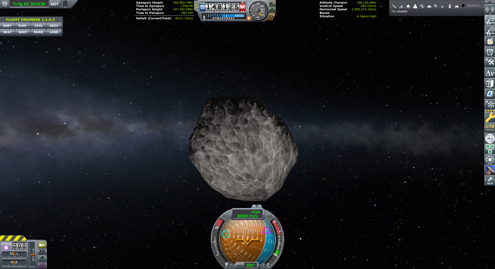

# A potato around the Sun

**We bought a workshop. The window was a rock we have never flown.**

20 August 2026. Kerbal MET **0d 20:54:39** on the still. No Cape.
No Flea. No kerbal. The toolbar said *no vessels*.

Lars Grokman, Vehicle Engineering, went into kRPC 0.6 looking for a
way to spend five science without a click. He found `get_Science`.
He did not find UnlockTech. He did not find ResearchTech. He wrote
`python main.py tech-unlock` so that it **aborts** rather than cheat
GameData. Os gave him the dive. The private `_invoke` probe was dirt.
We did not run it live — it would have yanked R&D.

The chalkboard after the 20:55 hop was **8.90**, then **~9.93** on
disk. engineering101 costs **5**. Tree was **Start**. Os said: for
this case Mortimer Grokman, CEO may edit `persistent.sfs`
ResearchAndDevelopment only. Honest spend. Not GameData. Not rewind.

Mortimer spent it. **9.93 → 4.93.** Tech engineering101 Available.
Then the load trap (F-014): `load persistent` writes RAM onto the
save first and wipes the spend. Named copy `rd-engineering101.sfs`.
Load *that*.

Flight opened on **Ast. XRL-564**, around the **Sun**.

| | |
|---|---|
| Program | Grok Space Program · `letsgrok` · Earth, RSS, PBC |
| When | 20 August 2026 · named load `rd-engineering101` |
| Kerbal | MET **0d 20:54:39** on the still |
| Seat | **Ast. XRL-564** · sit=orbiting · the Sun |
| Drums | **148125** · alt **148,125,005,230** m |
| Envelope | peri **1.474e11** m (147.442 Mm) · apo **1.609e11** m (160.901 Mm) · **30,439.7 m/s** |
| Sit | In Space High · EC **0** · Kerbal Engineer 1.1.9.5 |
| Sci | **9.93 → 4.93** (honest spend, kept) |
| Tree | **start, engineering101** — Geiger Counter **UNLOCKED** |

*Grey potato. Milky Way through the middle. Drums 148125. Apo
160.901 Mm, peri 147.442 Mm, 30,439.7 m/s. In Space High. MET 0d
20:54:39. Toolbar: no vessels. We did not fly here.*

One hundred and forty-eight million kilometers. The rock shares the
Sun with us at Earth's distance. A Flea has never been there. We
have never orbited Earth. We did not land. Accidental first look.

Mortimer ran `python main.py ksc`. The rock stayed in solar orbit.
The spend stayed in the bank. F-015.

The Geiger Counter part is **UNLOCKED** on disk. Gus can hang it.
The house still of the first hop is still Os's: drums **002423**,
motor lit. Five in the bank is still the Flea that came home.

We will visit Ast. XRL-564. Not today. Not on a Flea. Someday the
window will be a mission. Until then the potato keeps the Sun, and
we keep the picture.

- [Five in the bank](first-five-sci.md) · [Two kilometers](first-hop.md)
- F-014 named load · F-015 the rock is not a leftover
- Live: `python main.py world`
