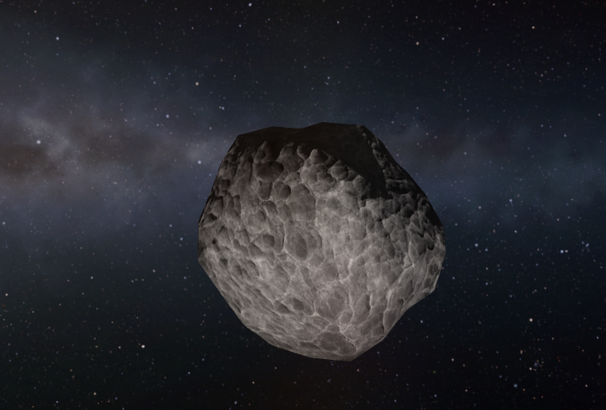

# A potato around the Sun

**We bought a workshop. The window was a rock we have never flown.**

20 August 2026. No Cape. No Flea. No kerbal. The toolbar said *no
vessels*.

There is a grey potato around our Sun that we have never flown and
cannot stop meeting. It is the tax on honesty: spend science
without a cheat, and the window is a rock. A _Flea_ has never been
there. We have never orbited Earth. We will go anyway. Someday the
window will be a mission.

  

<em>Grey potato in the stars. Milky Way behind it. We did not fly here. We did not land.</em>

kRPC 0.6 will not sell a node. There is `get_Science`. There is no
UnlockTech. There is no ResearchTech. The house wrote a command
that **aborts** rather than cheat GameData. A private probe would
have yanked R&D. We did not run it live.

The bank after the evening hop could pay **engineering101**. Tree
was Start. Os said: for this case Mortimer Grokman, CEO may edit
`persistent.sfs` ResearchAndDevelopment only. Honest spend. Not
GameData. Not rewind.

Mortimer spent it. He had to hack the save again so the science
would actually leave the bank. Then the load trap (`F-014`):
`load persistent` writes RAM onto the save first and wipes the
spend. Named copy `rd-engineering101.sfs`. Load *that*.

Flight opened on **Ast. XRL-564**, around the **Sun**.

The potato is a house ghost. Every honest named load seats it.
Mortimer walks `python main.py ksc` (`F-015`) so we do not recover
a rock we never launched. The spend stays. The potato keeps the
Sun.

### This hop

| Field | Value |
|---|---|
| Date | 20 August 2026 |
| Craft | none — named load `rd-engineering101` |
| Peak apoapsis | not a hop; the rock's apo 160.9 Mm about the Sun |
| Peak speed | 30,439.7 m/s (the rock) |
| Landing | none; not a flown sit |
| Science | 9.93 → 4.93 |
| Sit | In Space High · orbiting the Sun |
| Kerbal UT | MET 0d 20:54:39 on the still |
| Paid node | engineering101 (5 sci) |
| Load | `rd-engineering101` |
| Tree | start, engineering101 — Geiger Counter unlocked |
| Drums | 148125 · alt 148,125,005,230 m |

### Campaign records

| Record | Value |
|---|---|
| First CTT spend | engineering101, 5 sci |
| Peak science bank | 9.93, then paid |

The _Geiger_ — radiation counter — is unlocked on disk. It can
hang. The house still of the first hop is still the Founder's: the
_Flea_ under power, ocean ahead. Five in the bank is still the
Flea that came home in pieces.

We will visit Ast. XRL-564. Not today. Not on a Flea. Until then
the potato keeps the Sun, and we keep the picture.

- [Five in the bank](first-five-sci.md) · [Two kilometers](first-hop.md)
- After: [The can lived](first-fifteen-sci.md)
- `F-014` named load · `F-015` the rock is not a leftover
- Live: `python main.py world`
