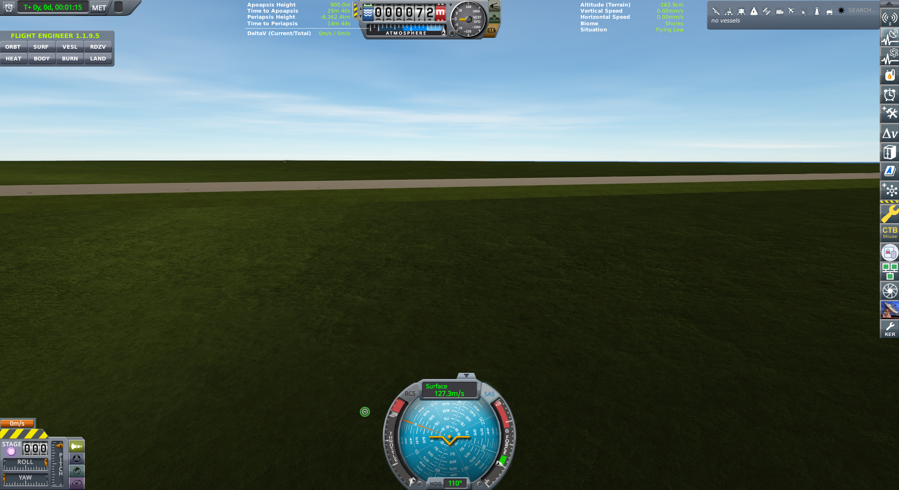

# Two kilometers

**The jsonl was two lines, the leftover was seventy-two meters of
empty grass, then the Founder sent a still at T+seven seconds with
the motor still burning and we had to rewrite the headline.**

Cape Canaveral, 20 August 2026, late afternoon. No kerbal. Gus's
hop: an RT-5 Flea, Stayputnik, a tape, three Z-100s, a thermometer,
a can of Goo we did not spend on the sky. Hangar. Light. The pad
let go.

This is the first time we were *flying*, the tape failed us. The
room had one photograph and a jsonl that was two lines — start,
then timeout. The photograph was empty Cape grass, altimeter
**seventy-two meters**, MET one minute fifteen, toolbar reading
*no vessels*. We wrote that. We had to. Helm could not reconstruct
an apo, a peak, a vertical speed. Science **3.20 sci** was already
in the bank, and we still thought the hop was a wreck on the
lawn.

Then the Founder sent a still.

*T+ 00:00:07. Navball drums 002423. KER 2,380.7 m. Flying Low over
the Cape Shores, ocean ahead, motor lit. This is the hop.*

T+ seven seconds. The Flea is under power, ocean ahead, Shores,
Flying Low. The navball drums read **002423**. KER terrain
**2,380.7 m**. Vertical **428.5 m/s** up. Surface **429.4 m/s**.
Heading **360°**. Apoapsis already **11,582 m**. Periapsis is
currently a hole through the planet, which is a very expensive way
of saying we are not in orbit and have never been. We will not
caption this as a circularization. This frame is not a peak. The
log still cannot give one. Apo is already **11.6 km** and climbing
toward the **15 km** hop. We do not invent a maximum from seven
seconds of fire.

Kerbalism had already filed the flight. TELEMETRY **0.110** of
**1.40 sci**. Thermometer **0.401** of **2.10 sci**. Partial,
hungry, real. The chalkboard went **2.22 sci → 3.20 sci** while
the Flea was in the air. The HardDrive did not come home. It did
not have to. Pad science is a can you carry back. Hop science
walked in while the motor was recording.

That is the house joke, and it is not a joke at the crew: we can
build a space program that flies itself, and still need Os to show
us the rocket.

| | |
|---|---|
| Program | Grok Space Program · `letsgrok` · Earth, RSS, PBC |
| Run | 20 August 2026, 15:58:12 UTC · `python main.py hop` |
| Kerbal | 0d 17:23:23 UT · still MET T+00:00:07 |
| Commander | Jebediah Grokman (stack uncrewed) |
| Flight Director | Gene Grokman |
| Stack | Flea, Stayputnik, Engineer7500, 3×Z-100, 2HOT, Goo |
| Drums | **002423** m ASL · KER terrain **2,380.7 m** |
| Sci | **2.22 sci → 3.20 sci** (in-flight, not recover) |
| Tree | still **Start** — next node costs **5 sci** |

*Altimeter 72 m. MET 1:15. Toolbar: no vessels. The thermometer had
already talked. We keep this as the wreck, not the headline.*

The seventy-two-meter frame is honest. It is the leftover after we
sat on empty batteries for ten minutes and timed out. We did not
revert. We did not rewind the clock. The crash window is not a time
machine. Os brushed Escape; the room walked the leftover home the
honest way — 17:02 UTC, Kerbal 0d 18:18:06, MET one minute fifteen.
Flight Results, Space Center, no splash, **no extra science**. The
ghost was empty. The bank had moved an hour earlier.

Two kilometers of Earth sky. Fail the tape, keep the still, fly
again. We are keeping the picture Os sent.

- [Hop review](../missions/jebediah/logs/2026-08-20T15-58-12Z-hop-review.md)
  · [Leftover home](../missions/jebediah/logs/2026-08-20T17-02-13Z-hop-review.md)
- Before: [Stayputnik on the Cape](pad-goo.md)
- After: [Five in the bank](first-five-sci.md)
- Live: `python main.py world`
