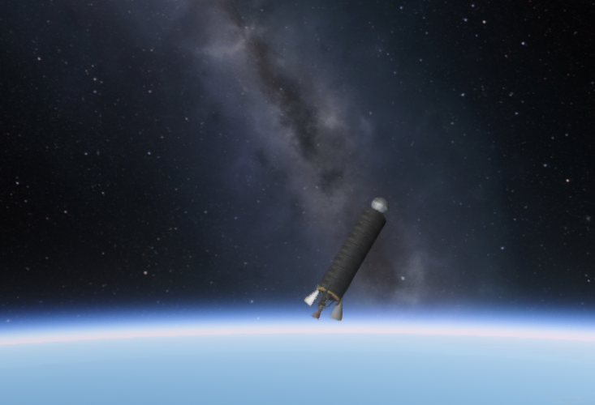
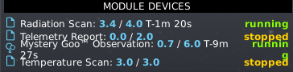

# The smiles came home

**We hung silk on a burning stack, put girders on rockets like a
space elevator, and flew inland into the same Forest until the sky
went black. Then the Geiger smiled, and the HardDrive came home.**

Cape Canaveral, 24 August 2026, late afternoon. No kerbal on the
stack. A _Stayputnik_ — black probe core, no steering wheel of its
own — on seven tanks and an LV-T15, the _Valiant seven-tank_. Gene
said go. The pad let go.

Fifty kilometers and up is the first band that is actually
space-ish on this Earth. We lofted **two hundred and seventy-five
kilometers**. Ballistic. Suborbital. We have never flown orbit.

  

<em>A Stayputnik and seven tanks over a thin blue limb. Stars. Not a circle.</em>

The High band over the Forest had been a lid we kept starting
under. A _2HOT_ thermometer, a can of _Mystery Goo_, a _Geiger_
radiation counter waiting since the workshop. Linus had bound
leftover telemetry, the Goo, and the Geiger since the morning the
stack finally cleared the lid. The afternoon hop ran the
thermometer and came home wet. The evening hop lit the Goo and the
Geiger together, dwelled in the High band, and the smiles went on
the HardDrive.

The stack sat in the black like it had all the time in the world,
because for a few minutes, it did. A radiation counter does not
know it is a first. It just ticks.

<table>
<tr>
<td width="50%"></td>
<td width="50%"></td>
</tr>
<tr>
<td><em>The Geiger is running. The Goo is running. The smiles are in the can.</em></td>
<td><em>The Cape is empty. kRPC is idle. The ships came home.</em></td>
</tr>
</table>

Three days earlier the house had already *been*. This same
seven-tank lofted past the lid, splashed, recovered — and the card
Toggle'd at the grass. Kerbalism filed crumbs from air that was
still weather. Earth paid nothing. Space was a rumor we kept
starting under.

Then we invented latitude, hung a parachute, and spent a day in a
Forest with no trees.

<table>
<tr>
<td width="50%"></td>
<td width="50%"></td>
</tr>
<tr>
<td><em>Inland, over city lights. There is not a tree in the window.</em></td>
<td><em>Dark grass, a pond, a red-and-white canopy. The lab said Forest.</em></td>
</tr>
</table>

The wrecks, in the order the room survived them:

- We opened the parachute with the engine still talking.
- We armed a canopy on the way up and called it a plan.
- We asked physics for a hurry in Q, and the stack became a Stayputnik.
- We drew a lid and kept lighting under it.
- Then we held vertical, slew inland, and the sky went black.

| When | What happened | Peak | End |
|---|---|---|---|
| 21 Aug, 13:31 UTC | First High; science at the grass | 88.8 km | splash, +0 |
| 24 Aug, morning | Same Forest, still under the lid | ~30 km | land / splash, bank 9.47 |
| 10:49 UTC | _Mk16_ open, engine lit | — | silk-while-burn |
| 15:05 UTC | OFFPLAN over the Space line | 163.2 km | abort |
| 15:44 UTC | Canopy armed, tanks full | — | shear |
| 17:26 UTC | Physics 4× in Q | — | parts 28 → 1 |
| 17:42 UTC | Canopy out, engine waiting | 802 m | parts 28 → 1 |
| 18:15 UTC | Hold vertical after silk and slew | 389 m | rec=no |
| 18:34 UTC | Inland, empty tanks, thermometer | 274.5 km | splash, bank 12.45 |
| 19:57 UTC | Goo and Geiger; 4× after dwell | 274.9 km | bank 16.19, parts 20 → 9 |
| 20:16 UTC | Goo and Geiger; dwell in the black | 276.1 km | leftover, bank 17.89 |

Fail, Learn, patch, fly again. That loop is the agency. Comms went
deaf and we taught the house to sit still. The lid was altitude,
not a predicted apoapsis. Deploy is a descent. Warp is for empty
tanks and quiet air. Then the same command again, if the stack
still lived.

### This hop

| Field | Value |
|---|---|
| Date | 24 August 2026, 20:16 UTC |
| Craft | _Valiant seven-tank_ `kspstuff-hop-valiant-t7-pbc` |
| Peak apoapsis | 276.1 km, suborbital |
| Landing | leftover wreck; HardDrive recovered |
| Science | 16.19 → 18.19 |
| Sit | Flying High @ Forest |
| Kerbal UT | 3d 13:31:02 UT |
| MET | 599.4 s |
| Tree | start, engineering101, basicRocketry, survivability, stability |
| Paid node | stability (18 sci) |
| Load | `rd-stability` |
| Next node cost | generalRocketry 20 sci |
| Leftover | Geiger 1.45 / 3.60; Forest High TELEMETRY 0.29 / 1.80 |

### Campaign records

| Record | Value |
|---|---|
| Highest apoapsis | 276.1 km, 24 Aug 20:16 UTC, suborbital |
| Peak science bank | 18.19, then paid |
| First High | 21 Aug 13:31 UTC, 88.8 km, +0 |
| First Goo + Geiger in the High band | 24 Aug 20:16 UTC |

<table>
<tr>
<td width="50%"></td>
<td width="50%"></td>
</tr>
<tr>
<td><em>The parachute is open. The engine is still talking. This is not a landing.</em></td>
<td><em>A porch of girders climbing past the Milky Way, because why not.</em></td>
</tr>
</table>

  

<em>Earth is round, and pretty enough to lie about. Not a circle.</em>

kRPC will not sell a node. Mortimer Grokman, CEO paid stability: he
edits the bank and loads a named copy — never the live save. Load
the live save and the spend vanishes. That trap is `F-014`. The
potato around the Sun is `F-015`: an asteroid we did not fly,
seated because the window was honest. Do not rewind the clock. The
crash window is not a time machine.

The _Geiger_ leftover from that High came home the next morning.
We have never orbited Earth.

The frontier was a lid we had drawn ourselves. We took the long
way. The black does not clap. The HardDrive does.

- [18:34 hop](../archive/reviews/2026-08-24T18-34-09Z-hop-review.md)
  · [20:16 Goo+Geiger](../archive/reviews/2026-08-24T20-16-38Z-hop-review.md)
  · [20:49 `rd-stability`](../archive/reviews/2026-08-24T20-49-30Z-load-review.md)
  · [06:36 Geiger leftover](../archive/reviews/2026-08-25T06-36-38Z-hop-review.md)
  · [13:31 first High, +0](../archive/2026-08-23-md-cutover/missions/jebediah/logs/2026-08-21T13-31-03Z-hop-review.md)
  · [17:42 silk-while-burn](../archive/reviews/2026-08-24T17-42-28Z-hop-review.md)
- Before: [The forest forgave us](forest-for-the-trees.md)
- House still: [Two kilometers](first-hop.md)
- Live: `python main.py world`
