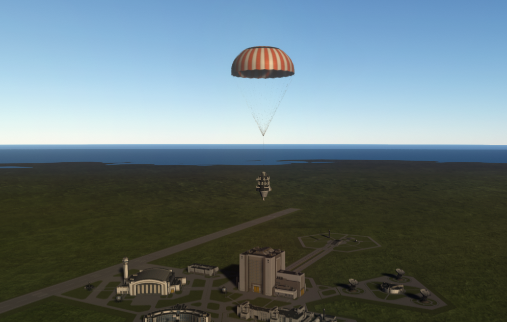

# The forest forgave us

**We hung a parachute on an OKTO, put girders on everything because
why not, had to invent latitude and longitude just to leave the
Cape, and Forest took the bill — there were no trees.**

Cape Canaveral, 23 August 2026, late morning. Jebediah Grokman on
the helm. A Probodobodyne OKTO — another black core, still no
steering wheel of its own — a _Mk16_ parachute, a Valiant, a
procedural tank, a _2HOT_ thermometer, a can of _Mystery Goo_, and
enough Modular Girder Segment to look like we were building a
bridge. Gene said go. The pad let go.

Forest is west. East is Water, and Water is dead on a core with no
wheel. Straight up is Cape Shores forever. We flew inland anyway,
and the biome took the bill.

  

<em>Dark grass, a pond, a red-and-white canopy. The lab said Forest. There is not a tree in the window.</em>

Linus had bound thermometer science over the Forest, in the air
that is still weather — the Low band — since the Cape lawn. Shores
in that band was already capped. Straight-up hops kept banking Cape
grass and wondering why Forest would not move. Then Wernher
Grokman, Chief Systems Engineer, put latitude and longitude on the
tape, haversine from the pad, because the radio could not tell
Forest from Shores live. We had been landing on the Cape and
calling it a biome problem. Couldn't we see the Forest for the
trees the whole time along?

There were no trees. RSS Earth does not grow a stock pine belt for
the press. The still is dark grass and a pond. The HardDrive still
came home.

The wrecks, in the order the room survived them:

- We packed a parachute and lithobraked anyway. Arm was not deploy.
- We armed the canopy and never said the word that opens it.
- FAR sheared the tank and engine off. The _OKTO_ kept talking.
- We opened silk at apoapsis and killed the inland run.
- We logged a westward heading and did not hold it.
- We came home to the grass we already knew, because we had no
  coordinates.

“Deploy” had meant *arm* all morning. The Valiant answered with
silk. Then with Shores. Then, finally, with Forest.

| When | What happened | Peak | End |
|---|---|---|---|
| 00:10 UTC | Mk16 never armed; helm still believed *No chute* | — | 154 m/s Shores |
| 06:53 UTC | Chute armed; never deployed | — | 154 m/s, canopy a rumor |
| 07:06 UTC | FAR shear, tank and engine gone | — | 1,283 kg → 270 kg, 154 m/s |
| 07:21 UTC | Impact called shear because the vessel died | — | 91 m/s, parts 0 |
| 08:04 UTC | Flying Low Goo finished | — | living recover, bank 5.67, still Shores |
| 08:29 UTC | Vertical hop | 16.8 km | tape biomes=[Shores] |
| 08:54 UTC | Canopy at apoapsis | 13 km | inland horiz died |
| 09:16–10:33 UTC | Slew logged, not held | — | Forest is a heading, not a stdout line |
| 10:47 UTC | Living recover, still Shores on the envelope | — | 5 m/s; no lat/lon |

### This hop

| Field | Value |
|---|---|
| Date | 23 August 2026, 11:11 UTC |
| Craft | OKTO on girders `kspstuff-hop-valiant-proc-stiff-pbc` |
| Peak apoapsis | 30.8 km, suborbital |
| Landing | land, Forest, 5 m/s |
| Science | 5.67 → 7.77 |
| Sit | Flying Low @ Forest |
| Kerbal UT | 2d 21:21:39 UT |
| MET | 386.4 s |
| Tree | start, engineering101, basicRocketry, survivability — Mk16 unlocked |
| Next node cost | stability 18 sci |

### Campaign records

| Record | Value |
|---|---|
| First Forest Low-band thermo | this hop, +2.10 |
| Softest landing | 5 m/s, Forest |
| First living Mk16 recover inland | this hop |

<table>
<tr>
<td width="50%"></td>
<td width="50%"></td>
</tr>
<tr>
<td><em>A canopy, at last. Not armed with nothing out.</em></td>
<td><em>Batteries in a ring, girders like a porch. Because why not.</em></td>
</tr>
</table>

  

<em>Over the Space Center. The tape said Shores. This is the morning we kept coming home to the grass we already knew.</em>

Mortimer does not spend this bank on a stunt. Stability still
waits. Do not hack the save for a node we have not paid. The
Geiger is unlocked; it is not this stack.

Couldn't we see the Forest for the trees. There were no trees.

- [11:11 hop](../archive/2026-08-23-md-cutover/missions/jebediah/logs/2026-08-23T11-11-21Z-hop-review.md)
  · [10:47, no where](../missions/jebediah/logs/2026-08-23T10-47-12Z-hop.md)
  · [07:06 shear](../missions/jebediah/logs/2026-08-23T07-06-08Z-hop.md)
  · [00:10 never armed](../missions/jebediah/logs/2026-08-23T00-10-20Z-hop.md)
- Before: [The can lived](first-fifteen-sci.md)
- House still: [Two kilometers](first-hop.md)
- After: [The smiles came home](first-space.md)
- Live: `python main.py world`
